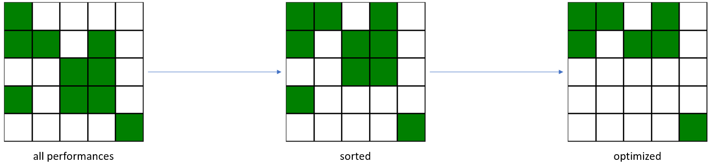
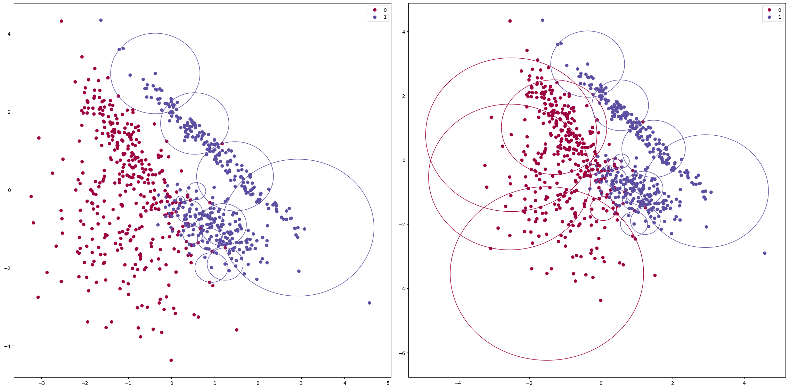

# SphereNet
## Idea behind SphereNet

The original core concept of SphereNet is to create for _n_ -dimensional input data a cluster of as many _n_ -spheres (in a
euclidean space) as needed to cover all data points defined as belonging to the _in_class_ with their volume, so that
new to-be-classified data points will also fall within the bounds of one of the spheres. If a new point to-be-classified
is outside the volume of all spheres, it is considered as _out_class_. This makes SphereNet a binary classifier. Technically
this means that for classification a distance will be calculated to the centers of all the spheres of the classifying
sphere cluster. If the distance to the center of one of those n-spheres is smaller than its radius, the point to-be-
classified will be classified as _in_class_ , else as belonging to  _out_class._

## Some Facts about this Classifier

- Has been written with numpy (linear algebra library) and numba, a JIT compiler for python and been built
to be able to handle large scales of data using highly optimized parallelized algorithms. So it should be fast,
even with a lot of data.
- Introduces new concepts (tunable hyperparams, like other distance measurements than the euclidean
metric) to SphereNet which can be configured as well as the possibility to use SphereNet as ensemble learning
method with multiple classes (MultiSphereNet).
- It can be used in the style of an scikit-learn classifier (easy to tune and practicability).

## How does it work?

Notice that every time running one of the functions for the first time in a script
it will take a little longer because of the JIT compilation.

### SphereNet

Default SphereNet binary classifier.

#### Parameters

- _in_class_ [default: 1]: The class that will be used to create the spheres inside volume.
- _min_dist_scaler_ [default: 1.0]: The value every sphere radius will be scaled by after calculating (before
optimization).
- _min_radius_threshold_ [default: -1]: Minimum radius threshold value. If a sphere radius is smaller it will be
thrown out (before optimization). Set to -1 to accept any sphere radius.
- _optimization_tolerance_ [default: 0]: Optimization tolerance (see below).
- _optimization_repetitions_ [default: 1]: Number of times to repeat optimization algorithm. Should only be
higher than one if using parallelized algorithm. Set to zero to not optimize.
- _optimization_parallel_ [default: False]: Parallelizing the optimization will make it a lot faster depending the
number of your CPU cores, but can lead (because of race conditions) to less spheres optimized out (i.e. not
keeping the best classifying ones but two slightly worse instead).
- _min_num_classified_ : [default: 2]: The minimum number of points from in_class that have to be classified by a
sphere for it to be kept. Prevents from creating single sphere-classifiers for every outlier or smaller outlier
clusters if this value is set higher.
- _max_spheres_used_ [default: -1]: Maximum number of spheres used. The optimal n spheres will be kept for
classification. Set to -1 to keep all spheres after optimization.
- _metric_ [default: 'euclid']: The metric used for distance measurement.
    - std: Standard deviation of x - y
    - minkowski
    - euclid
    - hamming
    - max: Maximum of |x - y|
    - cosine
    - jaccard
    - dice
    - canberra
    - braycurtis
    - correlation: Pearson correlation coefficient between x and y
    - yule
    - haversine
    - sum: Sum of x - y
    - mse: Mean squared error
    - ots: 1 / sum((x - y) ^ 2)
- _p_ [default: 2]: The p  value (order of magnitude) of the minkowski distance (when used) (_p_=1 equals manhattan distance, p =2 equals euclid distance).
- _standard_scaling_ [default: False]: Apply standard scaling on data with StandardScaler.
- _normalization_ [default: False]: Apply normalization on data with Normalizer.
- _remove_training_outliers_ [default: False]: Remove outliers with LocalOutlierFactor.
- _verbosity_ [default: 0]
    - 0: show no logs at all
    - 1: show text logs
    - 2: show text logs and progress bars

#### Training

For training, the _fit_ method can be called with input _X_ as 2d numpy array of training data (rows containing data-
points and different features in columns) and _y_ with the corresponding labels. Training the algorithm consists of
three steps:

##### 1. Preprocess

- Apply scaling if set by  standard_scaling.
- Apply normalization if set by  normalization.
- Remove outliers if set by  remove_training_outliers.

##### 2. Generating the spheres

- For every point of the  in_class find nearest (using the defined metric ) point not belonging to the in_class
(belonging to out_class ). Use the in_class point as center and the distance to this nearest outside point as
radius of a new sphere classifier.
- Scale each radius with min_dist_scaler and filter out points with min_radius_threshold.
- Create a performance boolean matrix (later used by optimization) and filter with  _min_num_classified_. Each
    row of the performance matrix stands for a point of the _in_class_ used as center with it's associated radius as
    classifying sphere. Its columns depict for each point of the  _in_class_ (here used as test points) a boolean value
    whether it is inside the sphere or outside using the defined _metric _ ( _short_ : rows depict points used as sphere-
    classifiers and columns depict for each point (here used as test-point) if it is classified by the row or not).

##### 3. Optimization

The second step will produce a huge performance matrix, only a small amount of points will be filtered out to be
used as classifying sphere. This third step will filter out a huge amount of spheres to be used as classifiers.

The main idea behind the optimization algorithm is to remove all rows, which's true-values are already contained in
any combination in one of the other activated rows (each column, where the row that is currently being tried to
remove contains a true-value, has a true-value in one of the other rows in the corresponding column). What this
means is, if all points a sphere classifies can be classified by another sphere-classifier or a combination of other
spheres, this row (classifier) can be removed. For the algorithm to be as fast as possible, the performance matrix
will be sorted by the amount of true-values each row has. When optimizing, it will first be attempted to remove rows
with less true values (more probable to be removed) and the searching for other true-values is done first in the rows
with most true-values, since they are more probable to contain the column's respective true-value. To note is, that
once a row is deactivated (optimized out / removed) by the algorithm, it will not be searched anymore by the
algorithm. This is another reason why the best classifying spheres are being tried to remove last.

The parameter  _optimization_tolerance _ defines the number of spheres that is already assumed to be found for each
row before searching for other true-values in the matrix. This way, the higher  _optimization_tolerance _ is set, the more
spheres will be removed. This can prevent overfitting, too large / complex models but also decrease accuracy.

#### Testing

A new point will be classified as the inside class, if it is inside one of the spheres that are left over after training. Else
it will be classified as belonging to the outside class.

#### Reducing algorithm size

If the algorithm has a too large number of spheres, another possibility than playing around with the
hyperparameters is to call the method _reduce_size _ after training the classifier. This will first calculate the distances
between all for the classification used spheres' centers with the defined _metric_. Those centers, that are from both
points' perspectives their respective nearest neighbor will be merged to one point by averaging their radius and
coordinates. This process can be repeated multiple times (set the _repetitions=n _ parameter). The smaller the
complexity of the classifier, the more accuracy it will probably lose, but this is typically not too high of a price for the
gained weight loss.

#### Notices

- The algorithm is extremely prone to outliers. It is advised to filter, generalize and scale data as good as
possible beforehand , this can have quite a big effect (actually not only on this classifier, this is a general
notice actually).
- Typically, the algorithm scales (produces more spheres) the larger the dataset.
Data augmentation can help when using small datasets (with noise), but will also create very fast a very high
complexity.
- The algorithm overfits very fast. Can be prevented with  optimization_tolerance  and min_num_classified as
well as appropriate preprocessing beforehand.
Scaling and normalization helps seldom, but sometimes.
- The  _metric_  hyperparameter is probably the most important to be tuned (there will be surprises!).
Using this with a non-euclidean distance metric means using it in a non euclidean room, so these are not
really hyperspheres anymore!

### MultiSphereNet

Whereas the normal SphereNet can only be used for binary classification, using MultiSphereNet will use SphereNet as
ensemble method (creating one SphereNet for every class).

#### Parameters

All parameters of SphereNet are applicable here as well. Additional parameters are:

- _pred_mode_ [default: 'conservative']: The prediction mode 
    - convervative: Fastest classification mode. If there is a conflict between classifications (point to be
classified is in spheres of multiple classes) it will not be resolved. Points that are classified as outside
by all SphereNets will be marked as class -1. This mode should be advised to not be used in production
cases.
    - careful: If there are classification conflicts, those will be resolved by comparing max inside distance
of the respective classifying sphere. This means the class of the sphere the point is further inside of will be used for class prediction. Points that are classified as outside by all SphereNets will be marked as class -1. This classification mode can improve the accuracy. The more conflicts there are to be resolved, the longer the classification takes.
    - force: Same as careful mode, but a class is forced if the point is outside of all SphereNets by using the class of the sphere border the point is nearest to. This can improve the prediction accuracy by quite a lot. The more conflicts and complete outside points there are to be resolved, the longer the classification takes. Reducing the min_dist_scaler  distance can improve in this mode the classification accuracy, but also make the model more complex. This will also produce more cases of complete outside points, means more classification calculations to be done.

#### Notices

- What makes the classification take longer by most is the number of spheres, not the classification mode.
- MultiSphereNet with  pred_mode 'force' is normally larger, but in almost all cases better than using only one SphereNet.

## Visual Comparison of MultiSphereNet and SphereNet on an Example

These are randomly generated data points belonging two different clusters: Class 0 (red) and class 1 (blue). The left
picture displays, which spheres the normal SphereNet implementation (with  _metric_ ='euclid' and  _min_num_classified_ =
and _in_class_ =1) would generate. Everything inside these spheres will be classified as belonging to class 1, everything
outside as belonging to class 0. This creates an predictions accuracy of 93.2%. In the right picture, two SphereNets (a
MultiSphereNet ensmble) has been used with _pred_mode_ ='force'. This improved the prediction accuracy to 95.6%.
